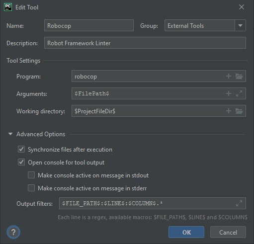

[](https://github.com/MarketSquare/robotframework-robocop/actions/workflows/unit-tests.yml "GitHub Workflow Unit Tests Status")


[](https://pepy.tech/project/robotframework-robocop)

---


Robocop
===============

- [Introduction](#introduction)
- [Documentation](#documentation)
- [Requirements](#requirements)
- [Installation](#installation)
- [Usage](#usage)
- [Example Output](#example-output)
- [Values](#values)
- [Fixing issues](#fixing-issues)
- [FAQ](#faq)

---

Introduction
------------

Robocop is a tool that performs static code analysis and formatting of [Robot Framework](https://github.com/robotframework/robotframework) code.

It uses official [Robot Framework parsing API](https://robot-framework.readthedocs.io/en/stable/) to parse files and runs number of checks,
looking for potential errors or violations to code quality standards (commonly referred as *linting issues*).

> Hosted on [GitHub](https://github.com/MarketSquare/robotframework-robocop).

Documentation
-------------

Full documentation is available [here](https://robocop.readthedocs.io). :open_book:

Most common questions with answers can be found at the bottom ⬇ of this README file.

Requirements
------------

Python 3.9+ :snake: and Robot Framework 4.0+ :robot:.

Installation
------------

You can install the latest version of Robocop simply by running:

```
pip install -U robotframework-robocop
```


Usage
-----

Robocop runs by default from the current directory, and it discovers supported files recursively.
To lint the files you can run:

```
robocop check
```

To format the files you can run:

```commandline
robocop format
```

All command line options can be displayed in help message by executing:

```
robocop -h
```

Example Output
--------------

Executing command:

```
robocop check --report rules_by_error_type test.robot
```


Will result in the following output:

```text
test.robot:17:1 SPC22 Not enough whitespace after 'Test Teardown' setting
    |
 15 |
 16 | Test Setup Keyword
 17 | Test Teardown Keyword2
    | ^ SPC22
 18 | Testtimeout 1min
 19 | Documentation this is doc
    |

test.robot:28:1 SPC14 Variable in Variables section is not left aligned
   |
 1 | *** Variables ***
 2 | ${VAR} 1
 3 |  ${VAR}  1
   | ^ SPC14
 4 |   ${VAR}  1
 5 | VALUE  1

Found 2 issues: 2 ERRORs, 0 WARNINGs, 0 INFO.
```

Values
-------
Original *RoboCop* - a fictional cybernetic police officer :policeman: - was following 3 prime directives
which also drive the progress of Robocop linter:

> First Directive: **Serve the public trust** :family_man_woman_girl_boy:

Which lies behind the creation of the project - to **serve** developers and testers as a tool to build applications they can **trust**.

> Second Directive: **Protect the innocent** :baby:

**The innocent** testers and developers have no intention to produce ugly code but sometimes, you know, it just happens,
so Robocop is there to **protect** them.

> Third Directive: **Uphold the law** :classical_building:

Following the coding guidelines established in the project are something very important to keep the code clean,
readable and understandable by others and Robocop can help to **uphold the law**.

FAQ
---
<details>
  <summary>Can I integrate Robocop with my code editor (IDE)?</summary>

  TODO: Update with dbhiel plugin.
  **Yes**, Robocop integrates nicely with popular IDEs like PyCharm or VSCode
  thanks to [Robot Framework Language Server](https://github.com/robocorp/robotframework-lsp).
  Read simple manual (README) in that project to figure out how to install & use it.

  TODO: update screenshot
  You can also use Robocop in PyCharm easily as an external tool.
  To configure it, go to: `File` → `Settings` → `Tools` → `External Tools`
  and click `+` icon. Then put values based on
  [official instructions](https://www.jetbrains.com/help/pycharm/configuring-third-party-tools.html)
  or this screenshot:

  

  If you're using Python virtual environment in your project,
  make sure to provide correct path to robocop.exe located in `venv\Scripts\robocop.exe`.
  Now, you can run Robocop by right-clicking on a file or directory and choosing
  `External tools` → `Robocop`.

  We suggest also to add a keyboard shortcut (e.g. `Ctrl + , (comma)`)
  to quickly run Robocop on selected files. You can map the shortcut in `Settings` → `Keymap`.
</details>

<details>
  <summary>Can I load configuration from file?</summary>

  **Yes**, you can use toml-based configuration files:

  **`.robocop` file**
  **`pyproject.toml` file**

  The difference between two is that ``pyproject.toml`` file does require ``[tool.robocop]`` sections while ``.robocop``
  do not.

  Example configuration file:

  ```toml
  [tool.robocop]
  exclude = ["deprecated.robot"]
  
  [tool.robocop.lint]
  select = [
    "rulename",
    "ruleid"
  ]
  configure = [
      "line-too-long.line_length=110"
  ]
  
  [tool.robocop.format]
  select = ["NormalizeNewLines"]
  configure = [
      "NormalizeNewLines.flatten_lines=True"
  ]
  ```

  Multiple configuration files are supported. However, global-like options such as ``--verbose`` or ``--reports`` are
  only loaded from top configuration file.

</details>

<details>
  <summary>I use different coding standards. Can I configure rules so that they fit my needs?</summary>

  **Yes**, some rules and formatters are configurable. You can find the configuration details in the documentation or
  by running:

  ```commandline
  robocop docs rule_name_or_id
  robocop docs formatter_name
  ```

  Configuring is done by using `-c / --configure` command line option followed by pattern
  `<name>.<param_name>=<value>` where:
  - `<name>` can either be rule name or its id, or formatter name
  - `<param_name>` is a public name of the parameter
  - `<value>` is a desired value of the parameter

  For example:

  ```
  robocop check --configure line-too-long.line_length=140
  ```

  ---
  Each rule's severity can also be overwritten. Possible values are
  `e/error`, `w/warning` or `i/info` and are case-insensitive. Example:

  ```
  robocop check -c too-long-test-case.severity=e
  ```

  ---
  If there are special cases in your code that violate the rules,
  you can also exclude them in the source code.

  Example:

  ```
  Keyword with lowercased name  # robocop: off
  ```

  More about it in  TODO check docs urls
  [our documentation](https://robocop.readthedocs.io/en/stable/including_rules.html#ignore-rule-from-source-code).

</details>

<details>
  <summary>Can I define custom rules?</summary>

  **Yes**, you can define and include custom rules using `--custom-rules` command line option
  by providing a path to a file containing your rule(s):
  ```
  robocop --custom-rules my/own/rule.py --custom-rules rules.py,external_rules.py
  ```

  If you feel that your rule is very helpful and should be included in Robocop permanently,
  you can always share your solution by
  [submitting a pull request](https://github.com/MarketSquare/robotframework-robocop/pulls).
  You can also share your idea by
  [creating an issue](https://github.com/MarketSquare/robotframework-robocop/issues/new/choose).

  More about external rules with code examples in
  [our documentation](https://robocop.readthedocs.io/en/stable/external_rules.html).
</details>

<details>
  <summary>Can I use Robocop in continuous integration (CI) tools?</summary>

  TODO: docs urls
  **Yes**, it is easy to integrate Robocop with CI and other tools.
  For more details read [our documentation](https://robocop.readthedocs.io/en/stable/ci.html).

</details>

----

> Excuse me, I have to go. Somewhere there is a crime happening. - Robocop
