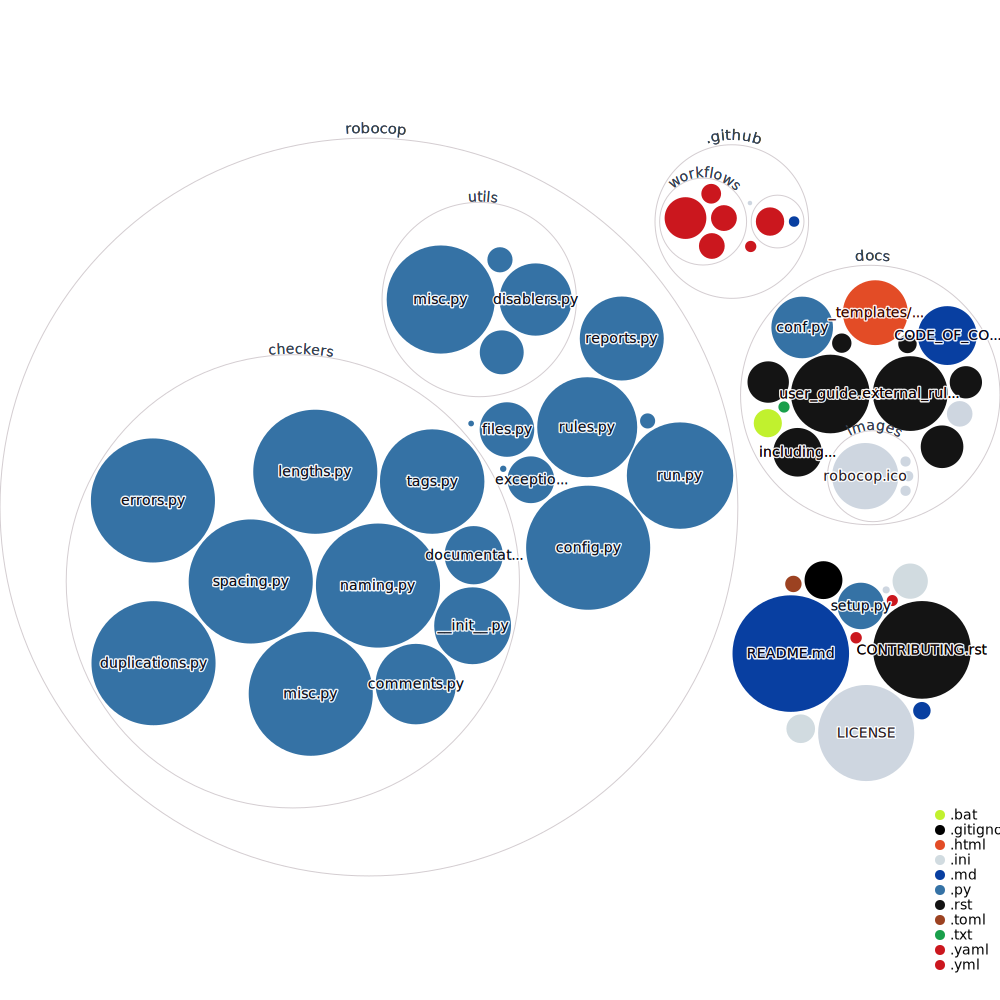

# Visual representation of the codebase excluding `tests` directory

Each folder is a circle and each file is a disc, where:
- the color represents the type of the file,
- the size of each disc is the size of the file.

