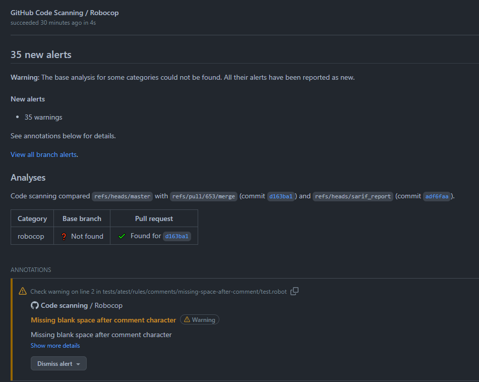

# Github

You can integrate Robocop results with `GitHub Code Scanning <https://docs.github.com/en/code-security/code-scanning/automatically-scanning-your-code-for-vulnerabilities-and-errors/about-code-scanning>`_.
It is possible to use SARIF (Static Analysis Results Interchange Format) output format. The example below shows
GitHub Workflow that runs the Robocop with ``sarif`` report and uses a produced file to upload results to
GitHub Code Scanning:

``` yaml title="robocop.yml"
    name: Run Robocop

    on:
      pull_request:
        branches: [ master ]

    jobs:
      build:
        runs-on: ubuntu-latest
        # continue even if Robocop returns issues and fails step
        continue-on-error: true
        permissions:
          # required for issues to be recorded
          security-events: write
        steps:
          - name: Checkout repository
            uses: actions/checkout@v3
          - name: Install dependencies
            run: |
              python -m pip install --upgrade pip
              pip install robotframework-robocop
          - name: Run robocop
            run: python -m robocop check --reports sarif
          - name: Upload SARIF file
            uses: github/codeql-action/upload-sarif@v2
            with:
              sarif_file: .sarif.json
              category: robocop
```

The Robocop issues will be recorded in the GitHub project:



Issue details:


See [SARIF](../linter/reports/sarif.md) for more information about the report and how to configure it.
