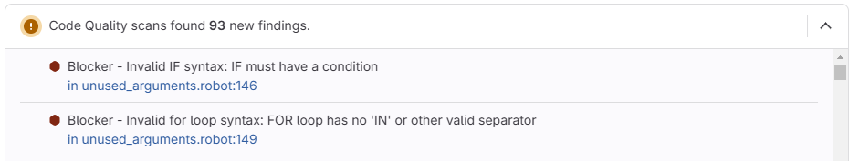

# Gitlab

You can integrate Robocop results with [Gitlab Code Quality](https://docs.gitlab.com/ci/testing/code_quality/#implement-a-custom-tool).

For that purpose you need to generate a report that supports a Code Quality format:

=== ":octicons-command-palette-24: cli"

    ```bash
    robocop check --reports gitlab
    ```

=== ":material-file-cog-outline: toml"

    ```toml
    [tool.robocop.lint]
    reports = [
        "gitlab"
    ]
    ```

It's also available using ``--gitlab`` option:

```bash
robocop check --gitlab
```

By default, it will produce ``robocop-code-quality.json`` file in the directory where Robocop was executed.
You will need to attach this file to Gitlab artefacts:

```yaml
stages:
  - lint

robocop:
  stage: lint
  image: python:3.12
  before_script:
    - pip install robotframework-robocop==6.0
  script:
    - robocop check --gitlab
  artifacts:
    reports:
      codequality: robocop-code-quality.json
```

The Robocop issues will be reported in the open pull requests:



See [gitlab](../linter/reports/gitlab.md) for more information about the report and how to configure it.
