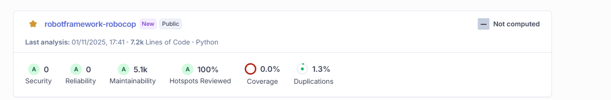

# SonarQube

Robocop results can be imported into Sonar Qube with [generic formatted result](https://docs.sonarsource.com/sonarqube-server/latest/analyzing-source-code/importing-external-issues/generic-issue-import-format)
or with [SARIF](https://docs.sonarsource.com/sonarqube-server/analyzing-source-code/importing-external-issues/importing-issues-from-sarif-reports)
format.

## Generic formatted result

Robocop generates a Sonar Qube generic formatted result with the SonarQube report. SonarQube report documentation
can be found [here](../linter/reports/sonarqube.md).

You can enable it by adding ``sonarqube`` to a report list:

=== ":octicons-command-palette-24: cli"

    ```bash
    robocop check --reports sonarqube
    ```

=== ":material-file-cog-outline: toml"

    ```toml
    [tool.robocop.lint]
    reports = [
        "sonarqube"
    ]
    ```

By default, it will produce ``robocop_sonar_qube.json`` file in the directory where Robocop was executed.

You will need to attach this file in the CI/CD by defining analysis parameter ``sonar.externalIssuesReportPaths``.

Since Robot Framework is not officially supported by SonarQube, you need to run a scanner manually and upload a report
to SonarQube. A typical workflow in CI/CD would be running Robocop (while generating a report) and then uploading
the report to SonarQube with the use of a scanner. Both SonarQube Cloud and on-premise support this.

When configuring the SonarQube project for the first time, chose manual upload for Python-based projects. It will
generate a command to be used with ``pysonar``. Most important for us are the token, name of the project and
organisation. If you have already established a project, you can find the token in "My Account" (under user avatar) ->
"Security".

After you install ``pysonar``, run the following command to upload the report:

```bash
pysonar --sonar-sources=tests --sonar-token=<token> --sonar-project-key=<project_key> --sonar-organization=<organization> --sonar-external-issues-report-path=<project_path>
```

With the following placeholders replaced:

- ``<token>`` - token from SonarQube
- ``<project_key>`` - project key from SonarQube, i.e. 'your_repo'
- ``<organization>`` - organization from SonarQube, i.e. 'your_company'
- ``<project_path>`` - path to the report file, by default it is ``robocop_sonar_qube.json``

Depending on your project, you might need to add additional parameters (such as project directory path, etc.)

After a successful upload, you should see the project and its issues in SonarQube:



Issues should be linked with the source code and contain documentation:


## SARIF

``SARIF`` is also supported. Robocop generates a SARIF file with the [SARIF](../linter/reports/sarif.md) report.
See the SonarQube documentation for more information on how to import it.
