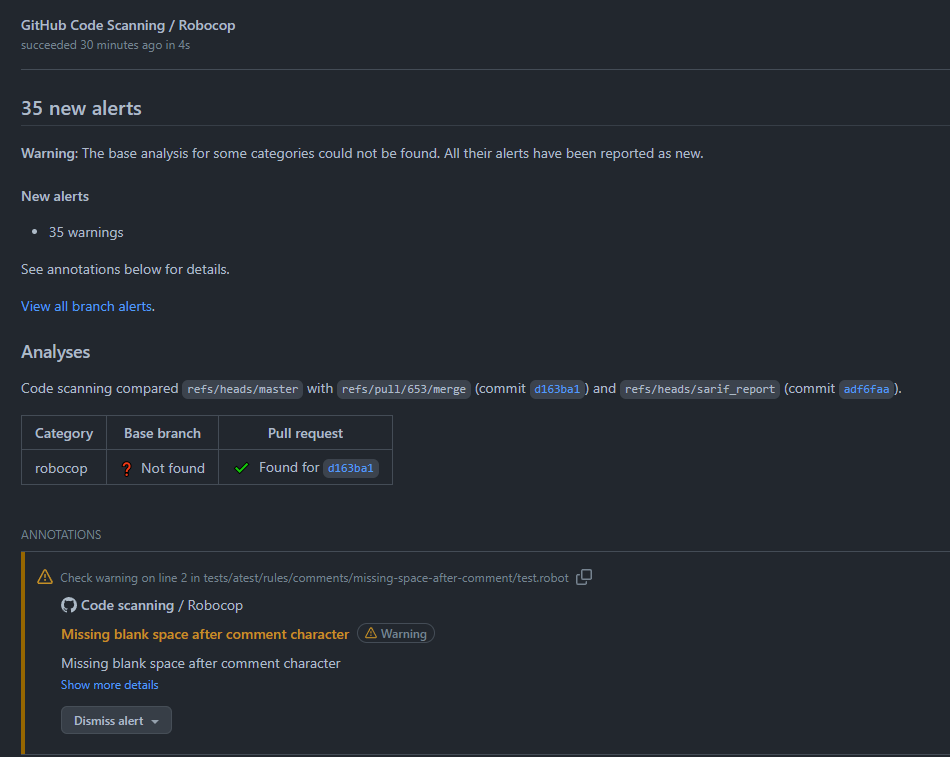
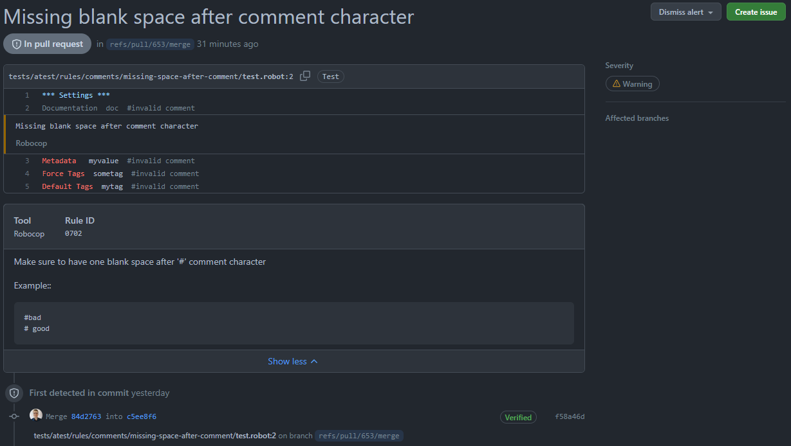

.. _integrations:

************
Integrations
************

* pre-commit: :ref:`pre_commit_integration`
* GitHub: :ref:`github_integration`
* Gitlab: :ref:`gitlab_integration`
* Sonar Qube: :ref:`sonarqube_integration`
* Jenkins: :ref:`jenkins_integration`

.. _pre_commit_integration:

pre-commit
----------

To use Robocop as `pre-commit <https://pre-commit.com/>`_ hook, you need following ``.pre-commit-config.yaml`` file::

    - repo: https://github.com/MarketSquare/robotframework-robocop
      # Robocop version.
      rev: v6.0.0
      hooks:
        # Run the linter.
        - id: robocop
        # Run the formatter.
        - id: robocop-format

It will run both linter and formatter on your modified files when trying to commit changes. If any linter issue is
found or file is modified, it will stop the commit.

``rev`` is version of the Robocop, prefixed with ``v``. It matches the release tag created in our repository on each
release.

.. _github_integration:

GitHub
------

You can integrate Robocop results with `GitHub Code Scanning <https://docs.github.com/en/code-security/code-scanning/automatically-scanning-your-code-for-vulnerabilities-and-errors/about-code-scanning>`_.
It is possible to use SARIF (Static Analysis Results Interchange Format) output format. Example below shows
GitHub Workflow that runs the Robocop with ``sarif`` report and uses produced file to upload results to
GitHub Code Scanning:

..  code-block:: yaml
    :caption: robocop.yml

    name: Run Robocop

    on:
      pull_request:
        branches: [ master ]

    jobs:
      build:
        runs-on: ubuntu-latest
        # continue even if Robocop returns issues and fails step
        continue-on-error: true
        permissions:
          # required for issues to be recorded
          security-events: write
        steps:
          - name: Checkout repository
            uses: actions/checkout@v3
          - name: Install dependencies
            run: |
              python -m pip install --upgrade pip
              pip install robotframework-robocop
          - name: Run robocop
            run: python -m robocop check --reports sarif .
          - name: Upload SARIF file
            uses: github/codeql-action/upload-sarif@v2
            with:
              sarif_file: .sarif.json
              category: robocop

The Robocop issues will be recorded in GitHub project:

Issue details:

You can configure Robocop using CLI or configuration file (:ref:`config-file`).

.. _gitlab_integration:

Gitlab
------

You can integrate Robocop results with `Gitlab Code Quality <https://docs.gitlab.com/ci/testing/code_quality/#implement-a-custom-tool>`_ .

For that purpose you need to generate report that supports Code Quality format::

    robocop check --reports gitlab

It's also available using ``--gitlab`` option::

    robocop check --gitlab

By default it will produce ``robocop-code-quality.json`` file in the directory where Robocop was executed.
You will need to attach this file to Gitlab artifacts::

    stages:
      - lint

    robocop:
      stage: lint
      image: python:3.12
      before_script:
        - pip install robotframework-robocop==6.0
      script:
        - robocop check --gitlab
      artifacts:
        reports:
          codequality: robocop-code-quality.json

See :ref:`gitlab` for more information about the report and how to configure it.

.. _sonarqube_integration:

Sonar Qube
----------

Robocop results can be imported into Sonar Qube with `generic formatted result <https://docs.sonarsource.com/sonarqube-server/latest/analyzing-source-code/importing-external-issues/generic-issue-import-format/>`_ .

Such report can be generated with ``sonarqube`` report::

    robocop check --reports sonarqube

By default it will produce ``robocop_sonar_qube.json`` file in the directory where Robocop was executed.
You will need to attach this file in the CI/CD by defining analysis parameter ``sonar.externalIssuesReportPaths``.

See :ref:`sonarqube` for more information about the report and how to configure it.

.. _jenkins_integration:

Jenkins
-------

Robocop is supported by `Warnings <https://plugins.jenkins.io/warnings-ng/>`_ plugin with Sarif report.

Run Robocop with Sarif report enabled in Jenkins pipeline::

    robocop check --reports sarif

Load the results using recordIssues step::

    recordIssues enabledForFailure: true, tool: sarif(pattern: '.sarif.json', name: 'Robocop linter issues')

It is also possible to generate other reports and archive them using archiveArtifacts plugin.

Read more on configuration in the `plugin documentation <https://github.com/jenkinsci/warnings-ng-plugin/blob/main/doc/Documentation.md>`_.
